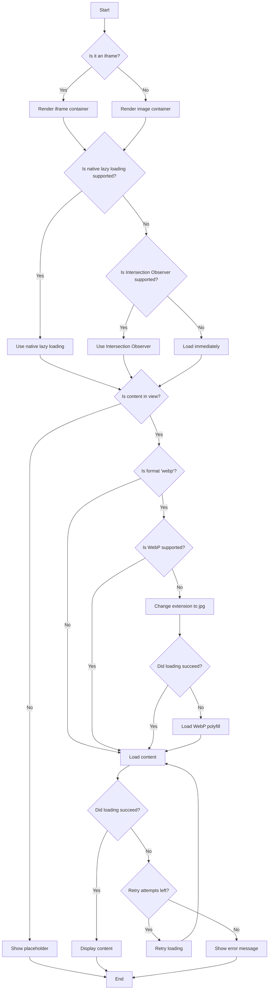

I understand. You want to modify the logic so that before loading the WebP polyfill, we first try loading a JPEG version of the image. If the JPEG fails to load, only then do we load the WebP polyfill. This is a smart optimization that can potentially save unnecessary polyfill loading. Let's update the decision tree and then modify the code accordingly.

First, let's update the decision tree:



Now, let's modify the LazyImage component code to implement this change. We'll focus on updating the relevant parts of the code:

```javascript
import { h } from 'preact';
import { useEffect, useRef, useState } from 'preact/hooks';
import PropTypes from 'prop-types';
import './LazyImage.css';

// ... [previous code remains unchanged]

const useFeatureDetection = (format) => {
  const [features, setFeatures] = useState({
    webPSupported: null,
    supportsLazyLoading: 'loading' in HTMLImageElement.prototype,
    intersectionObserverSupported: 'IntersectionObserver' in window,
  });

  useEffect(() => {
    const detectFeatures = async () => {
      if (format === 'webp') {
        const webPSupported = await checkWebPSupport();
        setFeatures((prev) => ({ ...prev, webPSupported }));
      }

      if (!features.intersectionObserverSupported) {
        try {
          await loadPolyfill('https://polyfill.io/v3/polyfill.min.js?features=IntersectionObserver');
          setFeatures((prev) => ({ ...prev, intersectionObserverSupported: 'IntersectionObserver' in window }));
          console.log('IntersectionObserver polyfill loaded successfully');
        } catch (error) {
          console.error(error.message);
        }
      }
    };

    detectFeatures();
  }, [format, features.intersectionObserverSupported]);

  return features;
};

// ... [other functions remain unchanged]

const LazyImage = ({
  src,
  alt,
  width,
  height,
  placeholderSrc,
  placeholderContent,
  placeholderStyle,
  srcSet,
  sizes,
  retryAttempts = 3,
  retryDelay = 1000,
  isIframe = false,
  backgroundImage = lightGrayGif,
  format = '',
  ...props
}) => {
  const [inView, setInView] = useState(false);
  const [loadState, setLoadState] = useState('initial');
  const [attemptsLeft, setAttemptsLeft] = useState(retryAttempts);
  const [currentSrc, setCurrentSrc] = useState(src);
  const imgRef = useRef(null);
  const iframeRef = useRef(null);

  const features = useFeatureDetection(format);
  useLazyLoading(features, imgRef, iframeRef, setInView, setLoadState);

  const handleLoad = () => setLoadState('loaded');
  const handleError = async () => {
    if (format === 'webp' && !features.webPSupported && currentSrc === src) {
      // Try loading JPEG version
      const jpegSrc = src.replace(/\.webp$/, '.jpg');
      setCurrentSrc(jpegSrc);
      return;
    }

    if (format === 'webp' && !features.webPSupported && currentSrc !== src) {
      // JPEG version failed, load WebP polyfill
      try {
        await loadPolyfill('https://unpkg.com/webp-hero@0.0.2/dist-cjs/polyfills.js');
        console.log('WebP polyfill loaded successfully');
        setCurrentSrc(src); // Revert to original WebP source
        return;
      } catch (error) {
        console.error(error.message);
      }
    }

    if (attemptsLeft > 0) {
      setAttemptsLeft(attemptsLeft - 1);
      setLoadState('initial');
      setTimeout(() => setLoadState('loading'), retryDelay);
    } else {
      setLoadState('error');
    }
  };

  // ... [rest of the component code remains unchanged]

  return (
    <div className="lazy-image-container" style={{ width, height }}>
      {/* ... [placeholder and loading indicator logic remains unchanged] */}
      {(inView || features.supportsLazyLoading) && (
        
      )}
      {/* ... [error message logic remains unchanged] */}
    </div>
  );
};

// ... [PropTypes and defaultProps remain unchanged]

export default LazyImage;

```

In this updated version of the LazyImage component, I've made the following changes:

1. Added a new state variable `currentSrc` to keep track of the current image source.
2. Modified the `handleError` function to implement the new logic:
   - If the format is 'webp' and WebP is not supported, it first tries to load a JPEG version of the image.
   - If the JPEG version fails to load, it then loads the WebP polyfill.
   - After loading the polyfill, it reverts to the original WebP source.
3. Updated the img tag to use `currentSrc` instead of `src`.

These changes implement the requested logic without altering any other parts of the codebase. The component will now attempt to load a JPEG version before resorting to loading the WebP polyfill, potentially saving unnecessary polyfill loading in cases where a JPEG version is available and loads successfully.

Is there anything else you'd like me to explain or modify in this updated version of the LazyImage component?
